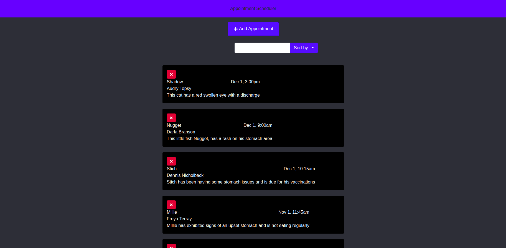
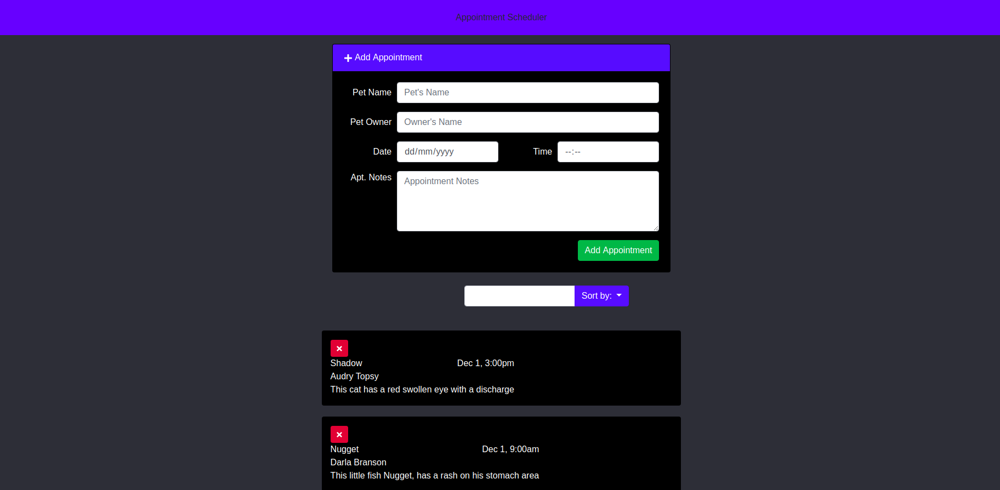
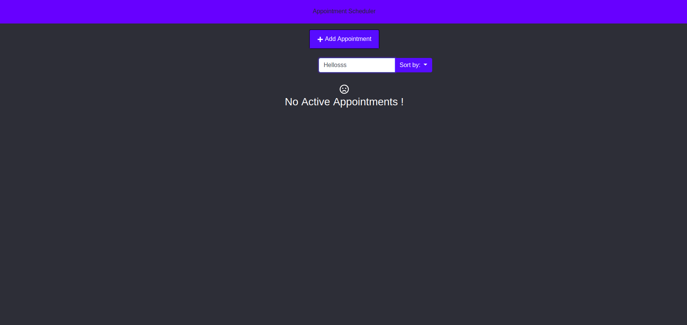

Appointment Booking - REACTJS PROJECT

## Library Used

1. loadash
2. bootstrap
3. react-moment
4. react-icons
5. jquery
6. Popper

## How to Run ?

In the project directory, you can run:

1. `npm install`

2. `npm start`

This will runs the app in the development mode. 
Open [http://localhost:3000](http://localhost:3000) to view it in the browser.

### ScreenShot

----

----

